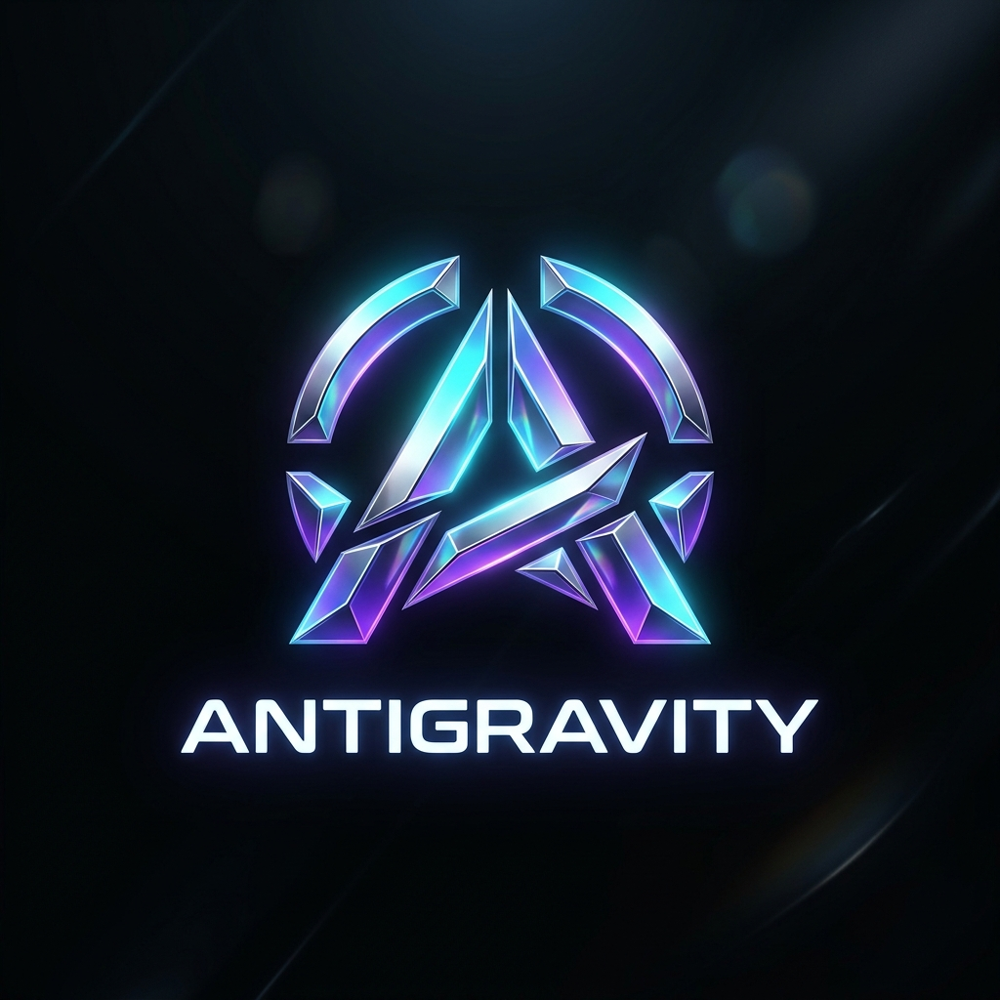
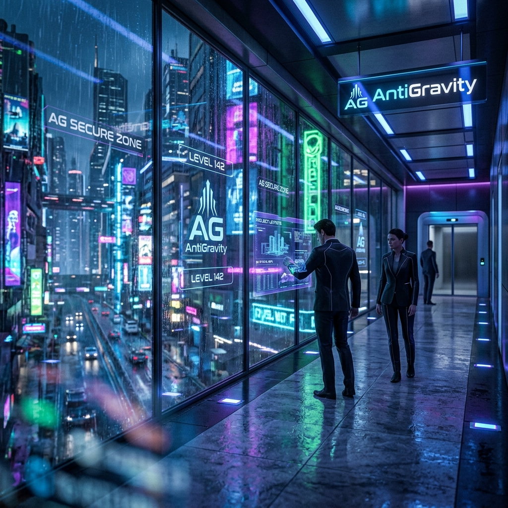
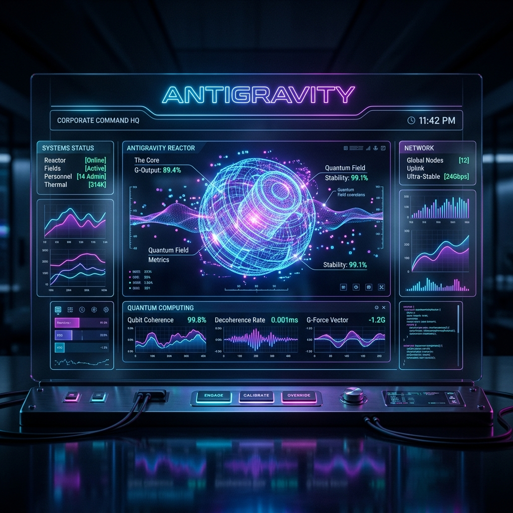
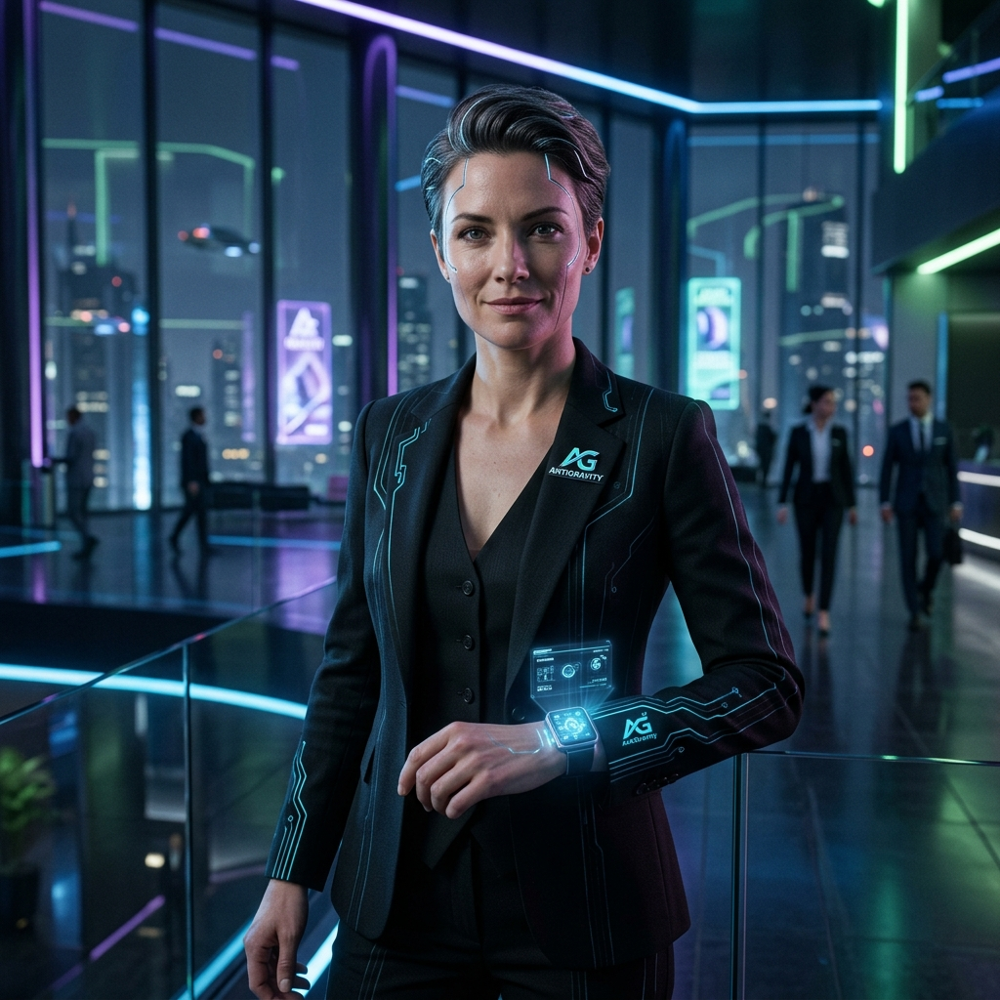
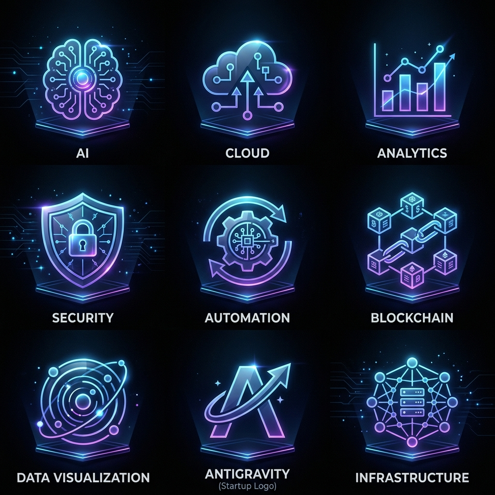
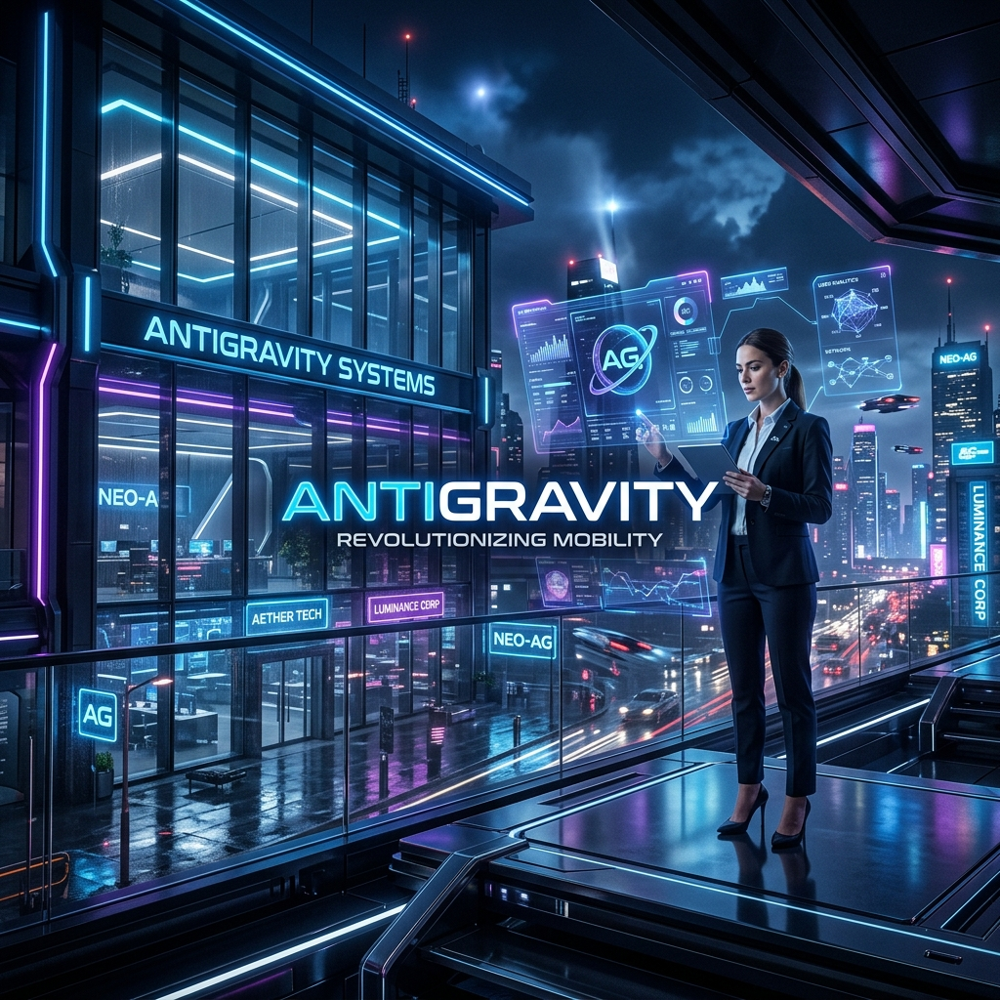

# AntiGravity — Cyberpunk Corporate AI & Gravity-Defying Tech

      

🌐 **Live Portal Demo**: [abakaushik-lgtm.github.io/TheCreativeVisionary](https://abakaushik-lgtm.github.io/TheCreativeVisionary/)

A premium, interactive single-page corporate portal and branding system designed for **AntiGravity**—a high-tech cognitive startup. The system combines a sleek corporate identity with an immersive cyberpunk aesthetic, complete with dark glassmorphic panels, neon blue and purple volumetric lighting, holographic animations, and interactive interfaces.

---

## 🌌 Project Overview

**AntiGravity** represents the intersection of next-generation enterprise strategy and neon cybernetics. This repository hosts both the core brand identity guidelines and a fully interactive, responsive dashboard portal.

### Brand Parameters:
* **Theme**: Futuristic corporate meets neon cyberpunk
* **Mood**: Premium, intelligent, futuristic, clean, cinematic
* **Visual Style**: Holograms, reflective surfaces, volumetric lighting, sleek UI overlays, glassmorphism
* **Core Palette**:
  - 🔵 **Electric Blue** (`#00f0ff`): Symbolizes structural telemetry and quantum speed.
  - 🟣 **Neon Purple** (`#bd00ff`): Represents cognitive logic and cryptographic protection.
  - ⚪ **Chrome Silver** (`#e2e8f0`): Provides high-contrast corporate typography.
  - ⚫ **Black Glass** (`rgba(3, 7, 18, 0.75)`): Formulates premium glassmorphic backdrops.

---

## 📁 Repository Folder Structure

```directory
TheCreativeVisionary/
├── assets/                          # Generated brand assets & mockup screenshots
│   ├── antigravity_dashboard.png    # Interactive console telemetry mockup
│   ├── antigravity_logo.png         # Minimal gravity-defying startup logo
│   ├── corporate_icons.png          # UI glassmorphic icon collage
│   ├── executive_strategist.png     # Consistent executive character portrait
│   ├── hero_hq.png                  # HQ skyscrapers background banner
│   └── social_banner.png            # Premium landscape layout banner
├── index.html                       # Semantic HTML5 scaffolding
├── script.js                        # Synthesizer, Canvas scanner, CLI & 3D tilt engine
├── styles.css                       # Color design systems, volumetric glows & keyframe rules
└── README.md                        # Documentation & setup guides
```

---

## 🚀 Features

The landing page functions as an active corporate command portal:

### 1. Cognitive Command Terminal CLI
An interactive terminal console constructed in pure JavaScript allowing users to execute system directives. Try entering:
* `/diagnose` — Scans cloud lattice nodes, diagnostic security blocks, and prints system checks.
* `/optimize` — Triggers a mock telemetry sweep, boosting cognitive alignment and quantum density progress.
* `/visualize` — Outputs active quantum vector logs and schematic charts.
* `/core` — Lists technical engine and processing hardware specifications.
* `/atmosphere` — Toggles the background synth hum drone on or off.
* `/clear` — Wipes the terminal history screen.

### 2. Biometric Scanner Canvas Overlay
Overlays live tracking brackets, rotating biometric radars, targeting grids, and facial synchronization readouts directly on top of the strategist's portrait using HTML5 Canvas rendering.

### 3. Atmospheric Soundscape Synthesizer
Uses the browser's native **Web Audio API** to compile a low-frequency sub-bass drone oscillator and slower modulator. Includes cybernetic audio chirps on UI hover and terminal actions when ATMOSPHERE is active.

### 4. 3D Glassmorphic Card Tilt
Applies coordinate-based 3D rotation matrix transformations to glass panel modules, scaling and tilting relative to cursor placement.

### 5. Telemetry Gauge Drifting
Renders dynamic telemetry parameters that shift value intervals automatically, simulating authentic background processing.

---

## 🎨 Brand Assets Showcase

The custom branding assets generated for the startup are integrated into the portal:

### Logo Concept
A minimal, gravity-defying geometric startup symbol with vibrant gradients on a deep black field.


### Hero Website Banner
Cinematic night skyline of the AntiGravity headquarters featuring skyscraper glass facades and rain reflections.


### Interactive Dashboard / UI Mockup
An ultra-realistic, high-tech command interface showcasing neon blue and purple telemetry visualization charts and glassmorphic panels.


### Corporate Strategist
Silver cybernetic facial features integrated with a black suit and blue glowing circuits.


### UI Icon Lattice
Highly detailed glow icons indicating AI, Cloud, Security, Analytics, Automation, and Blockchain components.


### Social Media Banner
Landscape header showing sleek interface overlays.


---

## 🛠️ Tools & Stack Used

* **Structure**: Semantic HTML5 markup, structured for accessibility.
* **Styling**: Vanilla CSS3 featuring:
  - Custom property variables for the visual token theme.
  - Pulsing volumetric `@keyframes` orbs and neon scanline transitions.
  - High-fidelity typography integrating Orbitron, Inter, and Share Tech Mono.
  - Backspace glassmorphic panels (`backdrop-filter: blur(16px)`).
* **Logic**: Vanilla ES6 JavaScript orchestrating Canvas overlays, interactive console logic, Web Audio Synthesizer, scroll spy nodes, and 3D coordinate-based tilting calculations.
* **Version Control**: Git & GitHub integration.

---

## 🔮 Future Improvements & Roadmap

To elevate the AntiGravity branding intelligence portal further, the following development pipelines are scheduled:
1. **AI Video Generation**: Integrate advanced text-to-video models (such as Sora, Runway, or custom Luma systems) to produce volumetric corporate HQ flythroughs and cinematic strategist presentations.
2. **Interactive Branding Dashboard**: Develop an active web UI controller permitting users to dynamically prompt, tweak, and recompile custom branding guidelines, color lattices, and image vectors inside the browser.
3. **Multi-Style Generation Modes**: Expand visual engine presets to permit real-time visual style switching between cyberpunk, brutalist corporate, vaporwave, solar-punk, and sleek retro-futurism.
4. **Decentralized Telemetry Lattices**: Connect terminal console diagnostics to peer-to-peer WebRTC connections, enabling instant decentralized dashboard telemetry synchronization between nodes.

---

## 💻 How to Run Locally

Since this portal is built entirely using vanilla, client-side technologies, it requires **zero installation steps** or dependency managers!

1. Clone this repository to your local machine:
   ```bash
   git clone https://github.com/abakaushik-lgtm/TheCreativeVisionary.git
   ```
2. Navigate to the repository directory:
   ```bash
   cd TheCreativeVisionary
   ```
3. Open `index.html` directly in any modern web browser (Chrome, Firefox, Safari, Edge):
   * Simply double-click the `index.html` file in your explorer, OR
   * Serve it locally using a light server tool:
     ```bash
     npx serve .
     ```
4. Click the **"ATMOSPHERE: OFF"** button in the header navigation bar to initialize the audio synthesizer drone!
